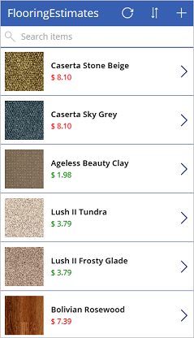
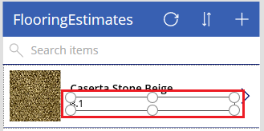
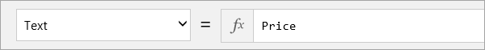
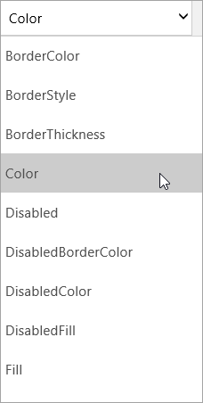

When you use Microsoft PowerApps, you don't have to write complicated application code the way a traditional developer does. But you still must express logic in an app and control its navigation, filtering, sorting, and other functionality. This is where formulas come in.

If you've used Microsoft Excel functions, you should recognize the approach that PowerApps takes. In this unit, we'll show a couple of basic formulas for text formatting and then walk through three of the formulas that PowerApps includes when it generates an app. You'll get a taste of what formulas can do and also start to write your own.

## Get started with formulas and properties
In the previous unit, we explored controls in all three screens of an app that PowerApps generated. In this section, we'll format the price that we added to the browse screen earlier.

By default, the price appears as a plain number without a currency symbol. But suppose that we want to add a dollar sign and change the text color based on the item's cost (for example, red if it's more than $5 but green otherwise). This graphic shows the expected result.

Let's start with the currency formatting. By default, PowerApps just pulls in a price value for each item. This value is set as the **Text** property of the label that shows the price.

1. In **BrowseScreen1**, select the price of the first item.

    

1. In the drop-down list of properties, select **Text**.

    

1. To add the currency symbol for US dollars, set the **Text** property to this formula:

    `Text(Price, "[$-en-US]$ ##.00")`

The **Text** function specifies how to format the number. The formula is like an Excel function, but PowerApps formulas refer to controls and other app elements instead of cells in a workbook.

If you select a control and then open the property drop-down list, you'll see a list of properties that are relevant to the control. For example, here is a partial list of the properties for a **Label** control. Some properties are relevant across a wide range of controls, but others are relevant only for a specific control.

To conditionally format the price's color, set the **Color** property of the price's **Label** control to this formula:

`If(Price > 5, Color.Red, Color.Green)`

## Formulas included in the generated app
Now that you understand how to use formulas in conjunction with properties, we'll look at a couple of formulas that PowerApps uses in every app it generates. Both the examples are from the browse screen and work with the **OnSelect** property. This property defines what happens when a user selects a control (for example, by clicking it with a mouse).

* The first formula is associated with the **IconNewItem1** control . You select this control to open the edit/create screen where you can create an item. The formula is:

    `NewForm(EditForm1);Navigate(EditScreen1, ScreenTransition.None)`

    The formula instantiates an edit form on the edit/create screen so that users can create an item. A value of `ScreenTransition.None` means there's no transition, such as a fade, between screens.

* The second formula is associated with the **IconSortUpDown1** control . You select this control to sort the items in the gallery. The formula is:

    `UpdateContext({SortDescending1: !SortDescending1})`

    The formula uses `UpdateContext` to update a variable called `SortDescending1`. The value of the variable switches back and forth as you select the control. This variable tells the gallery on this screen how to sort the items.

There are many other formulas in the app, so take some time to select controls and see what formulas are set for various properties.

For more information about these and other functions, see the [formula reference](https://docs.microsoft.com/powerapps/maker/canvas-apps/formula-reference).

## Wrapping it all up
This brings us to the end of our exploration of the generated app and our behind-the-scenes look at the screens, controls, properties, and formulas that give the app its capabilities—and even its personality. If you've followed along, you should have a better understanding of how a generated app works. You can now take this understanding and use it to create your own app.