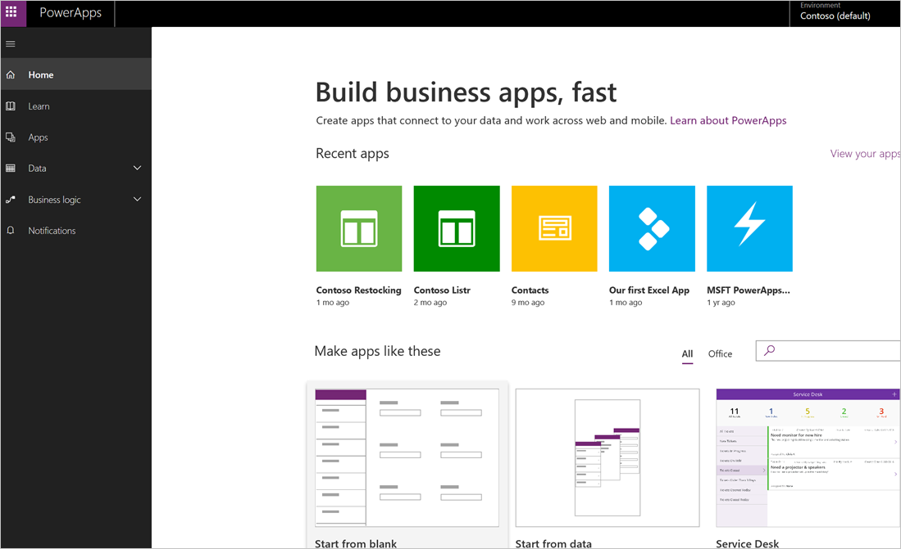
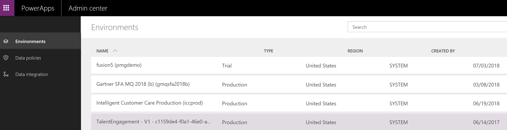

In the first unit, you learned about the main parts of Microsoft PowerApps. We're now going to dive deeper into each part. The PowerApps components are:

* **web.powerapps.com**: Apps start here, whether you build them from data, a sample app, or a blank screen.
* **PowerApps Studio**: Flesh out your apps by easily connecting to data, adding and arranging user interface (UI) elements (known as controls), and building formulas.
* **PowerApps Mobile**: Run your apps on Microsoft Windows, Apple iOS, and Google Android devices.
* **PowerApps admin center**: Manage PowerApps environments and other components.

## web.powerapps.com
If you build apps, you'll start here. You can build apps from sample apps, from templates, or from a blank screen. All the apps that you've built appear here, along with any apps that others have created and shared with you.

## PowerApps Studio
PowerApps Studio is where you flesh out your apps to make them more effective as a business tool — and to make them more attractive. PowerApps Studio has three panes that make creating apps feel more like building a slide deck in Microsoft PowerPoint:

- Left pane, which shows a hierarchical view of all the controls on each screen or a thumbnail for each screen in your app.
- Middle pane, which shows the app that you're working on.
- Right pane, where you set options such as the layout and data sources for certain controls.

## PowerApps Mobile
PowerApps Mobile for Windows, iOS, and Android devices provides an environment where you can find and use your apps. You don't need to open separate app stores to use all the apps that you've created and that others have shared with you. When you use apps in PowerApps Mobile, you get the most out of your device's capabilities: camera controls, GPS location, and more.

## Admin center
The PowerApps admin center is the centralized place for managing PowerApps for an organization. On this site, you define different environments that house the apps and where you define data connections and other elements. The admin center is also where you manage permissions and data policies.

In the next unit, you'll learn about the set of related technologies that PowerApps works with to make a powerful ecosystem for app development.