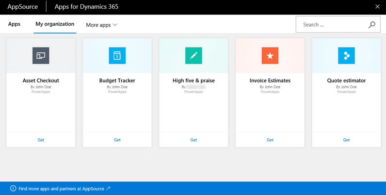

Microsoft PowerApps works with other technologies to help you build and share apps across your organization. Let's take a look at some of these technologies:

- **Microsoft Dynamics 365**: Dynamics 365 is the home for all your business apps: Microsoft Power BI, Microsoft Flow, Dynamics 365 for Talent, and many others.
- **Microsoft AppSource**: AppSource is where you share apps and download other apps that might be useful to your business.
- **Data sources**: Without data, you don't have a business. Data sources bring cloud and on-premises data into your apps. You access data through built-in connections, custom connectors, and gateways.

## Dynamics 365
The Dynamics 365 home page provides one place to run all your business apps, whether they come from app makers in your organization, Microsoft, or external companies.

## AppSource
AppSource is the place to find and evaluate apps from your colleagues, from Microsoft, and from our partners. In PowerApps, you share apps to AppSource. Users can then view and run those apps in Dynamics 365 or on mobile devices. In AppSource, you can make your apps available to the public or just to people in your organization.

## Data sources, connections, and gateways
In PowerApps, you can add many data sources to your apps through built-in or custom connectors. These data sources are some of the most popular.

Many data sources are cloud services, like Salesforce. Even Twitter can be a data source if, for example, you're tracking your company's hashtags. Connectors might not feel like the coolest part of app development. However, they're essential when you work with data that you, your colleagues, and your customers care about. And when an app shows up with your data source for the first time, you'll suddenly find they're very cool!

For data that's stored on-premises instead of in the cloud, you use a gateway to provide a reliable connection between PowerApps and your data source. The gateway sits on an on-premises computer and communicates with PowerApps.

You now know a little more about all the parts of PowerApps and related technologies. As you go through this module, you'll continue to deepen your knowledge about each part.
