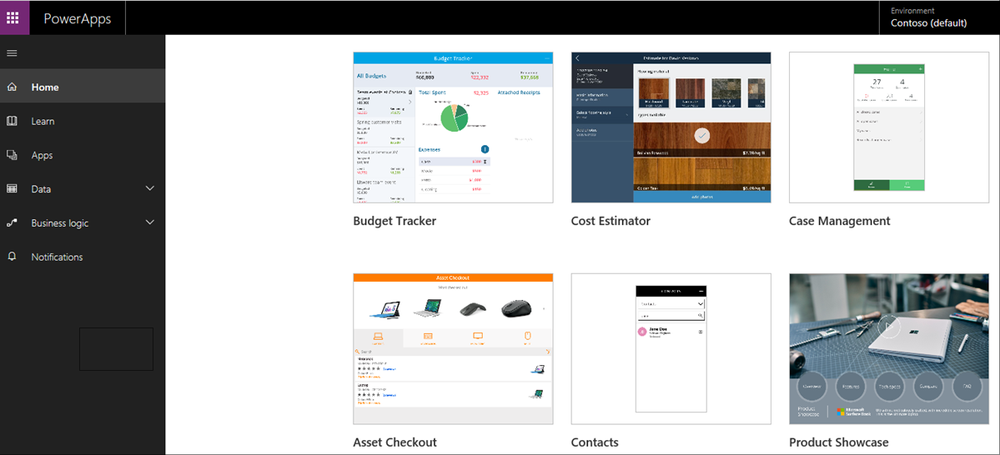
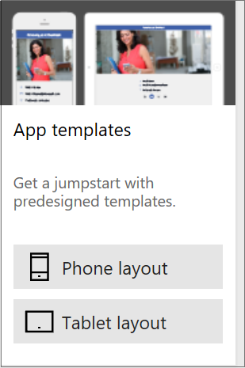
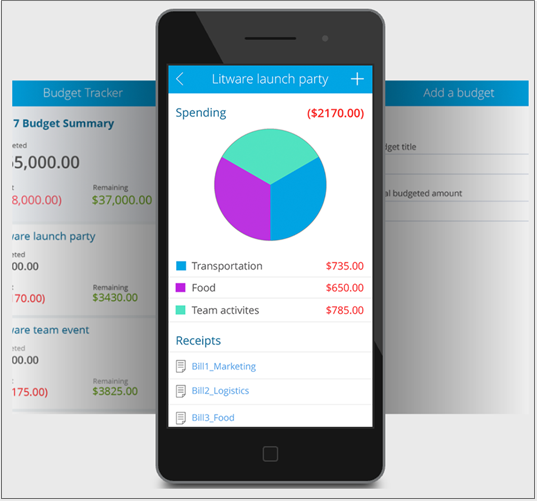

Now that you know the basics, let's get to building an app in Microsoft PowerApps.

## Ways to build PowerApps
In this unit, we'll look at how to create an app from a sample app, a template, a shared app, or a data source. In the next unit, we'll get more hands-on with app creation.

### Check out some sample apps
On web.powerapps.com, you'll be greeted with several sample apps that you can use in your web browser. Explore these apps to quickly get a sense of what's possible and how PowerApps can help your business.

Each sample app is designed for a specific purpose, such as:

- Managing a budget.
- Inspecting a site.
- Tracking service tickets.

These samples also contain sample data to inspire your thinking. For example, this app can help service representatives for a flooring company give accurate and immediate cost estimates when they visit customer locations.

### Create an app from a template
Another good way to create an app is to start from a template. Templates use sample data to help you get a sense of what's possible. By opening them in PowerApps Studio, you can learn hands-on how an app is built.

For example, you can use the Budget Tracker template to create an app that helps you track the budget for projects and events, with custom categories, easy data entry, and visuals that highlight expenditures for easy inspection.

### Use shared apps
If your team has started to use PowerApps, others might have shared apps with you already. If the app maker gave you permission to edit the app, it appears on web.powerapps.com, where you can open, customize, and share the app.

### Create an app from a data source
A great way to get started is to generate an app from your own data. Just point PowerApps at the data source of your choice (for example, a list in Microsoft SharePoint), and watch as PowerApps automatically builds a three-screen app.

This app was created from a SharePoint list and lets you browse items in the list, view item details, and create and edit items. After PowerApps generates an app, you can customize it to make it look and behave exactly the way you want.

### Build from the ground up
You can also build app from scratch and add all the pieces as you go. You can then branch out and let your imagination run wild. There will be plenty of that later in this module!

The easiest way to learn about PowerApps is to start with a sample app, open a template, or connect to your data source and have PowerApps generate the app for you.

In the next unit, you'll learn how to generate an app from data.