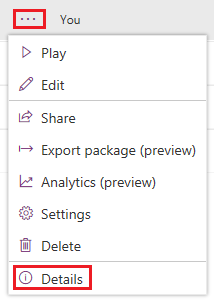
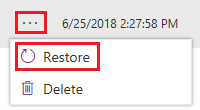

Microsoft PowerApps can help you out if you saved changes to an app that you shouldn't have or something else goes wrong. For apps that you save in the cloud, PowerApps keeps a history of the changes that you make. You can view each version that you've saved and restore your app to a previous version if necessary. If you shared the app, the people you shared it with will also receive the restored version if you publish the app again.

## View versions of your app

1. On [web.powerapps.com](http://web.powerapps.com), select **Apps** near the left edge.

1. In the list of apps, elect an ellipsis (**...**), and then select **Details**.

    

1. Select the **Versions** tab.

    The tab shows all versions of your app that you saved as you developed the app.

## Restore a previous version

1. Select an ellipsis (**...**), and then select **Restore**.

    

1. Select **Restore** again to confirm the action.

    A new version is added to your list.

When you restore a version of an app, the newly restored version gets a new, incremented version number and appears at the top of the list. A new version never overwrites a previous version.

Now that you know how to view versions of your apps and restore them if necessary, let's move on to the next unit, where you'll learn how to share your apps.